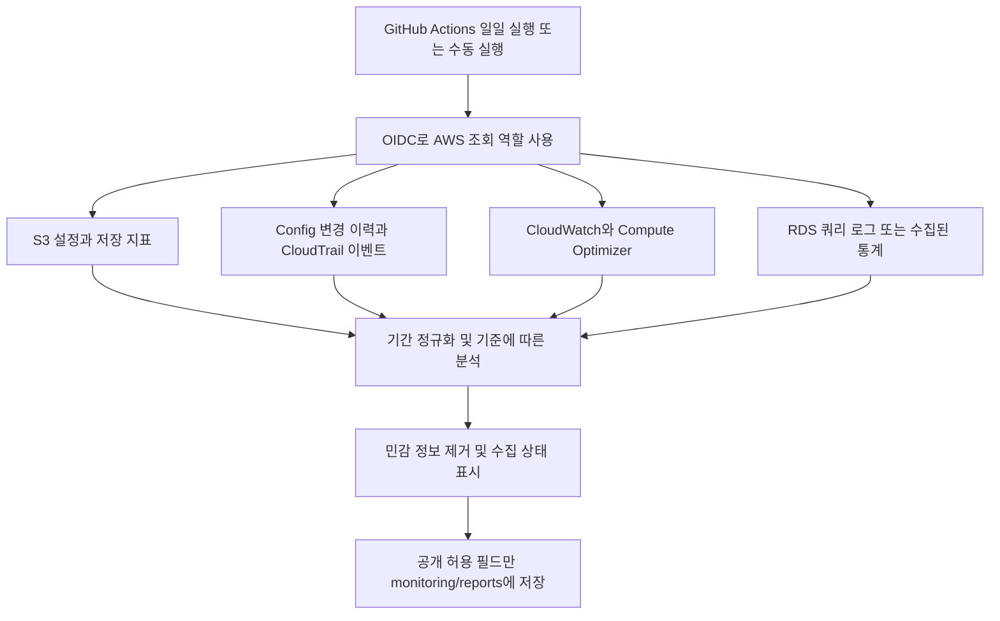

# AWS 운영 일일 리포트 설계

작성 기준: 2026-10-07. 기존 애플리케이션 배포와 별개인 모니터링 프로젝트다. 설계 문서와 공개 가능한 일일 요약을 **공개 저장소 [dlask913/aws](https://github.com/dlask913/aws)의 `monitoring/` 폴더**에 보관한다. 실제 계정·리소스·사용자와 연결되는 원본 증적은 비공개로 관리한다.

Python + Boto3 수집기, 공개 필드 검사, 오프라인 테스트, GitHub Actions 워크플로를 구현했다. **실제 AWS 계정은 아직 연결하지 않았으며 실데이터 검증과 자동 게시 활성화는 하지 않았다.** 아래 내용은 전체 설계 목표이며, 현재 구현 범위와 제한은 [SETUP.ko.md](SETUP.ko.md)에 구분했다. 먼저 [데모 보고서](samples/demo.md)와 테스트로 확인할 수 있다.

## 공개 범위와 폴더 구조

공개 저장소에는 설계와 샘플, 명시적으로 공개하기로 한 요약만 둔다. 비밀 키뿐 아니라 SQL·이벤트·오류 문자열에 포함되는 운영 정보도 게시 전에 걸러야 한다. 별칭을 사용해도 사용량이나 운영 패턴이 드러날 수 있으므로 공개할 지표 범위를 정한다.

| 데이터 | 공개 보고서 | 비공개 증적 |
| --- | --- | --- |
| 계정·리소스 | `account-a`, `compute-a`, `database-a` 같은 중립 별칭 | 계정 ID, ARN, 실제 이름·ID, 엔드포인트, 별칭 대응표 |
| 변경 주체 | `operator-a`, `automation-a`와 사용자/역할 구분 | 실제 사용자명·이메일·역할 ARN·세션·IP |
| 변경 내용 | 승인된 필드의 요약과 변경 건수, 공개용 발견 항목 ID | Config 전체 설정, IP/CIDR, 태그, 정책 원문, CloudTrail 이벤트와 콘솔 링크 |
| RDS SQL | 공개용 쿼리 별칭과 승인된 집계 수치 | SQL 원문, 테이블·컬럼명, 바인딩 값, 원본 쿼리 ID 대응표 |
| 상태·비용 | 승인된 요약 지표와 검토 상태 | 상세 시계열, 실제 청구 정보, 내부 장애 내용 |
| 수집 오류 | `권한 부족`, `미수집` 등 정해진 상태 코드 | 원본 예외·응답·로그 |
| 인증 정보 | 게시하지 않음 | AWS/GitHub의 자격 증명 관리 기능 사용. 파일로 커밋하지 않음 |

```text
monitoring/
  README.md                    # 설계·수집 기준·공개 범위
  daily-report-template.md     # 실제 데이터가 없는 공개 보고서 양식
  .gitignore                  # 로컬 원본·매핑·임시 파일 제외
  report.py                   # 수집·집계·공개 검증·Markdown 생성
  config.example.json         # 실제 식별자가 없는 설정 예제
  requirements.txt            # AWS SDK 의존성
  tests/test_report.py        # AWS 연결 없는 검증
  SETUP.ko.md                 # 실제 연결 및 실행 방법, 구현 경계
  infra/github-monitoring-role.yaml # OIDC 수집 역할 및 관리형 정책 연결
  infra/README.ko.md           # IAM 스택 배포·확인·삭제 방법
  samples/demo.md             # 실제 AWS 데이터가 아닌 예제
  reports/YYYY/MM/YYYY-MM-DD.md # 공개 요약 저장 경로
```

위 구조는 공개용이다. 비공개 파일을 단순히 같은 공개 저장소의 다른 폴더에 넣어서는 안 된다. 별칭 대응표와 원본은 접근을 제한한 별도 저장소에 둔다.

- 공개 출력은 허용한 필드로 새로 만든다. 원본 JSON을 문자열 치환만 해서 그대로 출력하지 않는다.
- SQL은 값을 제거한 정규화 문장도 기본 게시 대상에서 제외한다. 테이블·컬럼명 등이 남을 수 있기 때문이다.
- 공개 감사 표의 `operator-a`를 실제 사람과 연결하는 작업은 권한이 있는 운영자가 비공개 대응표로 수행한다. 확인할 수 없는 요청 주체는 추정하여 채우지 않는다.
- 일일 보고서를 커밋하기 전에 별칭 처리·허용 필드 검사와 검토를 거친다. 실패하면 게시하지 않고 일반화한 실패 상태만 남긴다.
- 공개 GitHub Actions의 로그·Job Summary·artifact에도 원본을 출력하거나 업로드하지 않는다. CLI 디버그 출력과 원본 예외 출력도 제한한다.
- `.gitignore`는 로컬 파일의 실수로 인한 추가를 줄일 뿐이다. Actions 로그, 이미 추적 중인 파일, 강제로 추가한 파일의 공개를 막아주지 않는다.
- 공개 후 파일을 삭제해도 Git 이력이나 다른 사람의 복사본에 남을 수 있다. 첫 실제 보고서는 공개용 내용으로 수동 검토한 뒤 자동 게시로 전환한다.

[GitHub 민감 정보 제거와 이력의 한계](https://docs.github.com/en/authentication/keeping-your-account-and-data-secure/removing-sensitive-data-from-a-repository)

## 1. 리포트가 답할 네 가지 질문

| 영역 | 질문 | 데이터 원천 | 일일 결과 |
| --- | --- | --- | --- |
| S3 수명 주기 | 보존 목적에 맞는 규칙이 있고, 저장량이 어떻게 변했는가? | S3 버킷 설정, CloudWatch 일일 저장 지표. 필요 시 Storage Lens/Inventory 추가 | 미설정·비활성 규칙, 적용 prefix, 만료·저장 등급 전환, 이전 버전·미완료 업로드 정리, 저장량 증감 |
| 구성 변경 감사 | 무엇이 바뀌었고, 어떤 계정·역할이 변경을 요청했는가? | AWS Config 구성 이력 + CloudTrail 관리 이벤트 | 변경 전후 값, 변경 요청 주체, 성공·실패, 근거 이벤트, 확인 필요 사항 |
| EC2 적정 크기 | 현재 사양이 과하거나 부족할 가능성이 있는가? | CloudWatch + Compute Optimizer. 메모리는 별도 수집 필요 | 사용 추세, AWS 권고, 근거와 부족한 데이터, 변경 검토 후보 |
| RDS 느린 쿼리 | 어떤 SQL이 느리며, 어떤 SQL이 전체 DB 시간을 많이 쓰는가? | 엔진별 느린 쿼리 로그 또는 쿼리 통계. Database Insights는 지원 범위에 따라 활용 | 쿼리 식별자별 실행 수·평균 지연·총 실행 시간·전일 대비 변화 |

리포트는 검토할 후보를 제시한다. 버킷 수명 주기 변경, EC2 크기 변경, DB 파라미터 수정은 실행하지 않는다.

## 2. 실행 구조



- AWS 인증: 기존 배포 역할과 분리한 모니터링 역할을 사용한다. OIDC 신뢰 조건은 `dlask913/aws`의 지정 실행 브랜치로 제한한다. 현재는 서비스별 AWS 관리형 정책 4개를 연결하는 절충안이며 API별 최소 권한보다 범위가 넓다. [IAM 스택 안내](infra/README.ko.md)에 권한 범위를 명시했다. 외부 기여자의 PR 코드를 AWS 인증 정보와 함께 실행하지 않는다.
- GitHub 저장: 게시 단계에서만 저장소 `GITHUB_TOKEN`의 필요한 쓰기 권한을 사용한다. 명시적으로 지정한 공개 보고서 파일만 커밋한다. AWS 조회 권한과 GitHub 쓰기 권한은 별개다.
- AWS 초기 설정: Config 기록 활성화, 로그 설정 등은 별도 설정 단계다. 일일 수집 역할에 변경 권한을 넣지 않는다.
- 스케줄 예시: 매일 한국시간 09:17에 전날 00:00 이상~다음 날 00:00 미만을 집계한다. 해당 UTC cron 예시는 `17 0 * * *`이다. 시간은 아직 확정되지 않았다.
- GitHub 예약 실행은 정확한 시각을 보장하지 않는다. 집계 기간은 실행 시각이 아닌 지정한 보고 날짜로 계산한다. 수동 재실행 시 같은 날짜의 보고서를 갱신한다.
- 원본 증적은 접근을 제한한 AWS 저장소에 보관한다. GitHub에는 별칭과 공개용 발견 항목 ID를 사용한다. 계정 정보가 포함된 콘솔 링크, 원본 식별자, SQL 원문, 고객 데이터, 인증 정보는 커밋하지 않는다.

[GitHub 예약 실행 문서](https://docs.github.com/en/actions/reference/workflows-and-actions/events-that-trigger-workflows#schedule)

## 3. S3: 수명 주기와 저장량

| 수집 항목 | 검토 기준 | 해석 시 주의 |
| --- | --- | --- |
| 버킷 용도와 보존 정책 | 배포 산출물·로그·백업·업무 데이터별 허용 보존 기간과 일치하는가? | 모든 버킷에 7일 만료를 일괄 권고하지 않는다. 보존 목적이 없으면 판단 보류 |
| Lifecycle 규칙 | 활성화 상태, prefix/tag 필터, 만료, 저장 등급 전환 확인 | 규칙 존재만으로 모든 객체에 적용된다고 판단하지 않는다 |
| Versioning과 이전 버전 정리 | 버전 관리 버킷에 `NoncurrentVersionExpiration` 등 필요한 정책이 있는가? | 현재 객체 만료만으로 이전 버전까지 영구 삭제되는 것은 아니다 |
| 미완료 멀티파트 업로드 | 중단된 업로드를 정리하는 규칙이 있는가? | 미완료 조각과 정상 업로드 객체를 구분한다 |
| 저장량·객체 수 | 최신 관측값과 이전 관측값의 차이를 표시 | S3 일일 지표의 실제 관측 시각을 함께 표시. 실시간 값으로 표현하지 않는다 |
| 객체 연령·저장 등급 분포 | 필요 시 Inventory 또는 제공되는 Storage Lens 지표로 분석 | 객체 전체를 매일 LIST하는 방식은 규모가 커지면 요청량이 증가한다 |

`GetBucketLifecycleConfiguration`, `GetBucketVersioning` 등으로 설정을 조회한다. 설정 미존재 응답과 권한 부족 응답을 분리한다. `AccessDenied`를 '수명 주기 없음'으로 표시하지 않는다.

초기 버전은 정책과 저장량 변화를 보고한다. **실제로 어제 몇 개가 Lifecycle에 의해 삭제됐는지**, **정확히 얼마를 절약했는지**는 추가 증적 없이 단정하지 않는다. 만료 시점과 실제 삭제 시점도 다를 수 있다.

[S3 수명 주기](https://docs.aws.amazon.com/AmazonS3/latest/userguide/intro-lifecycle-rules.html), [객체 만료](https://docs.aws.amazon.com/AmazonS3/latest/userguide/lifecycle-expire-general-considerations.html), [S3 CloudWatch 지표](https://docs.aws.amazon.com/AmazonS3/latest/userguide/cloudwatch-monitoring.html), [Storage Lens](https://docs.aws.amazon.com/AmazonS3/latest/userguide/storage_lens_basics_metrics_recommendations.html)

## 4. Config + CloudTrail: 구성 변경 감사

**Config는 상태 변화, CloudTrail은 API 호출 주체와 요청을 제공한다.** 두 기록을 시간·계정·리전·리소스·요청 내용으로 대조한다. Config의 기록 시각과 실제 API 호출 시각이 같다고 가정하지 않는다.

다음 표는 **비공개 수집·분석 단계**의 필드다. 공개 보고서에는 위의 공개 범위에 따라 별칭·요약만 내보낸다.

| 필드 | 비공개 기록 내용 |
| --- | --- |
| 대상 | 계정 별칭, 리전, 서비스, 리소스 식별자 |
| 변경 내용 | 바뀐 필드와 변경 전후 값. 일일 시작 직전 상태도 비교 기준으로 조회 |
| 요청 | `eventTime`, `eventSource`, `eventName`, `eventID`, 필요 시 `requestID` |
| 주체 | `userIdentity.type`, 역할·사용자 ARN, 역할 세션 정보. 사람이 식별되지 않으면 역할까지만 표시 |
| 결과 | API 오류 여부와 실제 구성 반영 여부를 구분. 성공한 API 요청도 비동기 적용 중일 수 있음 |
| 연결 근거 | 일치한 정보와 신뢰 수준. 여러 후보가 있으면 '추가 확인 필요' |
| 운영 판단 | 예정된 변경인지, 예상 범위인지, 확인이 필요한지 |

우선 추적 후보는 보안 그룹, EC2, RDS 인스턴스·파라미터 그룹, S3 설정, IAM 역할 정책, CloudTrail 기록 설정이다. 실제 Config 지원 리소스와 기록 필드는 리전별로 확인한다. Config에 없는 세부 변경은 CloudTrail과 별도 설정 스냅샷으로 보완한다.

- 일일 보고서를 만든다고 Config의 기록 빈도도 Daily여야 하는 것은 아니다. Daily는 하루의 마지막 상태 중심이므로 중간 변경이 빠질 수 있다. 상세 감사가 필요한 리소스는 Continuous 기록을 검토한다.
- Config를 활성화하기 전의 구성 이력이 자동 복원되지는 않는다. 첫 수집일은 기준 상태로 기록한다.
- CloudTrail Event history는 리전별 최근 90일 관리 이벤트를 제공하며 조회에 CloudTrail 요금이 없다. 장기 보존에는 별도 Trail/S3 등을 검토한다.
- 역할 세션은 사람이 아니다. GitHub 실행 ID나 CloudFormation 실행 기록까지 확인해야 요청을 시작한 사람을 좁힐 수 있다. 연결이 불확실하면 확정하지 않는다.
- 실패한 변경 시도는 실제 변경 건수와 별도로 집계한다. DB의 SQL 실행과 EC2 내부 파일 변경은 이 구성 감사만으로 전부 확인할 수 없다.

[Config 구성 이력](https://docs.aws.amazon.com/config/latest/developerguide/view-manage-resource-console.html), [Config 기록 빈도](https://docs.aws.amazon.com/config/latest/developerguide/select-resources.html), [CloudTrail Event history](https://docs.aws.amazon.com/awscloudtrail/latest/userguide/view-cloudtrail-events.html), [CloudTrail 사용자 식별](https://docs.aws.amazon.com/awscloudtrail/latest/userguide/cloudtrail-event-reference-user-identity.html)

## 5. EC2: 적정 크기 검토

하루치 상태와 최근 수 주의 적정 크기 판단을 분리한다. Compute Optimizer 기본 분석은 최근 14일을 사용하며 지원 대상과 최소 데이터 요건이 있다. 데이터가 부족하면 '판단 보류'로 보고한다.

| 지표 | 리포트 표시 | 용도 |
| --- | --- | --- |
| CPUUtilization | 일일 평균·최대, 최근 추세 | CPU 사용량 확인. 수집 간격에 따라 짧은 피크가 보이지 않을 수 있음 |
| CPUCreditBalance | 최저값·고갈 여부 | T 계열의 CPU 크레딧 부족 확인 |
| 메모리 사용량 | 평균·최대 또는 미수집 | EC2 기본 지표에는 없음. CloudWatch Agent 등 필요 |
| 네트워크·EBS 사용량 | 전일 대비 변화와 포화 징후 | CPU가 낮아도 네트워크·디스크 제약이 있을 수 있음 |
| 상태 검사 | 실패 횟수와 구간 | 인프라 상태 확인. 애플리케이션 정상 응답과 별개 |
| Compute Optimizer | 현재 사양, 권고 사양, 성능 위험, 생성 시각 | AWS 권고를 참고하되 자동 변경하지 않음 |

초기 검토 기준 예시는 '최근 14일 동안 지속적으로 낮은 CPU 사용 + 메모리 여유 확인 + 주요 업무 피크 포함 + Compute Optimizer 축소 권고'다. CPU 평균이 낮다는 이유 하나만으로 축소를 확정하지 않는다. 절감액이 제공되면 산정 조건과 추정값임을 표시한다.

[EC2 지표](https://docs.aws.amazon.com/AWSEC2/latest/UserGuide/viewing_metrics_with_cloudwatch.html), [CloudWatch Agent 지표](https://docs.aws.amazon.com/AmazonCloudWatch/latest/monitoring/metrics-collected-by-CloudWatch-agent.html), [Compute Optimizer 분석](https://docs.aws.amazon.com/compute-optimizer/latest/ug/metrics.html), [데이터 요건](https://docs.aws.amazon.com/compute-optimizer/latest/ug/requirements.html)

## 6. RDS: 느린 쿼리와 DB 부하

CPU나 DB 연결 수만으로 SQL별 실행 시간을 알 수 없다. 엔진과 활성화된 기능을 확인한 뒤 수집 경로를 선택한다. 초기 버전에서는 이미 수집 중인 쿼리 정보를 우선 사용한다.

| 경로 | 얻을 수 있는 것 | 사전 조건·한계 |
| --- | --- | --- |
| CloudWatch Database Insights | 지원 범위 내 상위 SQL과 DB 부하·대기 분석 | 엔진·모드·사용 가능한 API 확인 필요. DB 부하 순위와 평균 지연 순위는 다름 |
| PostgreSQL 느린 쿼리 로그 | 설정한 시간 이상 걸린 개별 SQL의 지연 | 예: `log_min_duration_statement`. 로그 설정과 수집 필요. SQL 리터럴 노출 주의 |
| PostgreSQL `pg_stat_statements` | 정규화 쿼리별 호출 수와 실행 시간 누계 | 확장·권한·접속 경로 필요. 일일 분석에는 시작·종료 스냅샷 차이 필요 |
| 다른 DB 엔진 | 해당 엔진의 느린 쿼리 로그 또는 집계 통계 | 엔진 확정 후 별도 수집기를 설계 |

일일 상위 쿼리는 두 표로 나눈다.

1. **평균 실행 시간이 긴 SQL**: 쿼리 식별자, 기간 내 실행 수, 평균 시간, 전일 대비 변화. 표본 수가 작으면 표시한다.
2. **총 실행 시간이 큰 SQL**: 쿼리 식별자, 기간 내 실행 수, 누적 실행 시간, 전체 수집 SQL 중 비중. 자주 실행되어 부하를 만드는 쿼리를 찾는다.

`pg_stat_statements`를 선택하면 일일 평균은 `총 실행 시간 증가분 / 호출 수 증가분`으로 계산한다. 누계 평균끼리 빼지 않는다. DB 재시작·통계 초기화·항목 퇴출 등으로 비교가 불가능하면 해당 구간을 불완전 데이터로 표시한다. 누계 최대값을 어제의 최대값으로 표시하지 않으며 이 집계만으로 p95를 산출하지 않는다.

느린 쿼리 로그만 수집한다면 순위와 평균은 **임계값을 넘겨 기록된 실행의 범위**임을 표시한다. 전체 SQL의 평균이나 p95로 표현하지 않는다. 공개용 쿼리 별칭과 허용한 수치만 게시하고, 원본 쿼리 식별자·SQL 원문은 비공개 저장소에서 권한 있는 사람이 확인한다.

GitHub 호스팅 실행기는 기본적으로 프라이빗 DB에 직접 접속할 수 없다. CloudWatch Logs 등 AWS API로 조회할 수 있는 경로를 우선 검토한다. 직접 SQL 통계 수집이 필요하면 VPC 내부 수집기와 제한된 DB 계정을 별도로 구성하고, 요약 결과를 S3 등에 보관한다. 이를 위해 DB를 퍼블릭으로 전환하지 않는다.

[Database Insights](https://docs.aws.amazon.com/AmazonRDS/latest/UserGuide/USER_DatabaseInsights.html), [PostgreSQL 쿼리 로깅](https://docs.aws.amazon.com/AmazonRDS/latest/UserGuide/USER_LogAccess.Concepts.PostgreSQL.Query_Logging.html), [pg_stat_statements](https://www.postgresql.org/docs/current/pgstatstatements.html)

## 7. 비용 구분

| 항목 | 비용 관점 | 초기 범위 |
| --- | --- | --- |
| CloudTrail Event history | 최근 90일 관리 이벤트 조회에는 CloudTrail 요금 없음 | 활용 |
| CloudTrail Trail 장기 보존 | 첫 관리 이벤트 사본 전달과 별개로 S3 저장·요청 등이 과금될 수 있음. 데이터 이벤트는 별도 | 보존 필요에 따라 선택 |
| AWS Config | 구성 항목 기록과 규칙 평가 등에 과금. Daily가 항상 더 싼 것은 아님 | 필요한 리소스 유형·리전만 선정. 감사 이력만 필요하면 불필요한 Rules 추가 안 함 |
| Compute Optimizer | 기본 권고 추가 요금 없음. 확장 분석 옵션 등은 별도 | 기본 기능부터 |
| CloudWatch | 기본 제공 지표와 커스텀 지표·API·로그·알람 요금 구분 | 수집할 지표와 조회량 제한 |
| EC2 메모리·앱 로그 | Agent 자체 설치 외에 커스텀 지표·로그 요금. 프라이빗 환경에서는 전송 경로 비용 가능 | 필요한 항목만 |
| S3 분석 | 일일 저장 지표와 별개로 Inventory·고급 Storage Lens·Athena·요청·저장 비용 가능 | 먼저 설정과 일일 저장 지표 |
| RDS SQL 수집 | 로깅 부하·저장량·조회량 또는 Database Insights 모드에 따른 비용 | 기존 수집 경로 확인 후 선택 |
| GitHub Actions | 공개 저장소의 표준 GitHub 호스팅 실행기는 실행 요금 무료. Larger runner 등은 별도 | 표준 Linux 실행기로 하루 1회. AWS 수집 비용과 구분 |

프리티어 잔여량을 비용 0의 근거로 사용하지 않는다. 실제 월 비용은 리소스 수·변경 빈도·로그량·조회량·리전이 정해져야 계산할 수 있다. 프라이빗 EC2에서 Agent가 직접 보낼 때는 CloudWatch 지표용 `monitoring`, 로그용 `logs` Interface Endpoint 등 필요한 경로를 따로 검토한다. AWS가 제공하는 EC2 기본 지표를 보기 위해 이 엔드포인트를 새로 만들 필요는 없다.

[CloudTrail 요금](https://aws.amazon.com/cloudtrail/pricing/), [Config 요금](https://aws.amazon.com/config/pricing/), [Compute Optimizer 요금](https://aws.amazon.com/compute-optimizer/pricing/), [CloudWatch 요금](https://aws.amazon.com/cloudwatch/pricing/), [CloudWatch 지표 엔드포인트](https://docs.aws.amazon.com/AmazonCloudWatch/latest/monitoring/cloudwatch-and-interface-VPC.html), [로그 엔드포인트](https://docs.aws.amazon.com/AmazonCloudWatch/latest/logs/cloudwatch-logs-and-interface-VPC.html)

[S3 요금](https://aws.amazon.com/s3/pricing/), [GitHub Actions 요금](https://docs.github.com/en/billing/concepts/product-billing/github-actions)

## 8. 보고서 품질과 검증

- 모든 항목에 집계 기간, 원천 데이터의 최신 시각, 수집 상태를 포함한다. 늦게 도착한 데이터는 정해진 보완 기간 내 재집계하고 보고서 개정 시각을 남긴다.
- '변경 없음', '기능 비활성', '권한 부족', '데이터 부족', '수집 실패'를 구분한다. 실패를 0건이나 정상으로 표시하지 않는다.
- 페이지네이션·API 제한·재시도를 처리하고 수집 범위를 명시한다. 모든 리전을 조회하지 않았다면 계정 전체 결과라고 쓰지 않는다.
- 감사 이벤트는 비공개 분석 단계에서 `eventID` 등으로 중복 제거한다. 공개본에는 원본 이벤트 ID를 내보내지 않는다. 변경 원인과 결과를 추정으로 연결하면 추정임을 표시한다.
- 보고서 재실행은 같은 날짜 파일을 갱신하도록 만들고 동시 실행을 제한한다. 민감 정보 검사 실패 시 게시하지 않는다.
- 검증은 저장된 익명 샘플로 정상·변경 없음·수집 실패·통계 초기화 사례를 확인한 뒤, 실제 AWS 콘솔의 동일 기간 결과와 대조한다.
- 급한 보안·장애 대응이 필요하면 일일 리포트와 별도 실시간 알림을 구성한다. 하루 한 번 수집은 실시간 탐지 기능이 아니다.

## 9. 실데이터 연결 전에 확정할 입력

| 입력 | 현재 상태 |
| --- | --- |
| 결과 위치 | 공개 GitHub 저장소의 `monitoring/reports/`에 날짜별 요약 |
| 저장소 주소 | [dlask913/aws](https://github.com/dlask913/aws) |
| 공개 지표·별칭 매핑·비공개 증적 저장 위치 | 범위 확정 필요 |
| AWS 계정 수·대상 리전·대상 리소스 범위 | 미정 |
| RDS 엔진·버전·기존 쿼리 수집 기능 | 미정 |
| Config·CloudTrail·Compute Optimizer 활성화 상태 | 미정 |
| 보고 시각·시간대 | 미정. 예시는 한국시간 오전 |
| 추가 수집 기능의 월 비용 한도 | 미정 |

구현한 수집기는 조회 → 분석 → 공개 스키마 검증 → Markdown 생성 순서로 실행한다. [SETUP.ko.md](SETUP.ko.md)에 따라 로컬 preview를 확인한 뒤 수동 Actions 실행과 예약 게시를 연결한다. [daily-report-template.md](daily-report-template.md)는 전체 설계를 위한 확장 양식이며 현재 생성기의 모든 필드와 동일하지는 않다.
